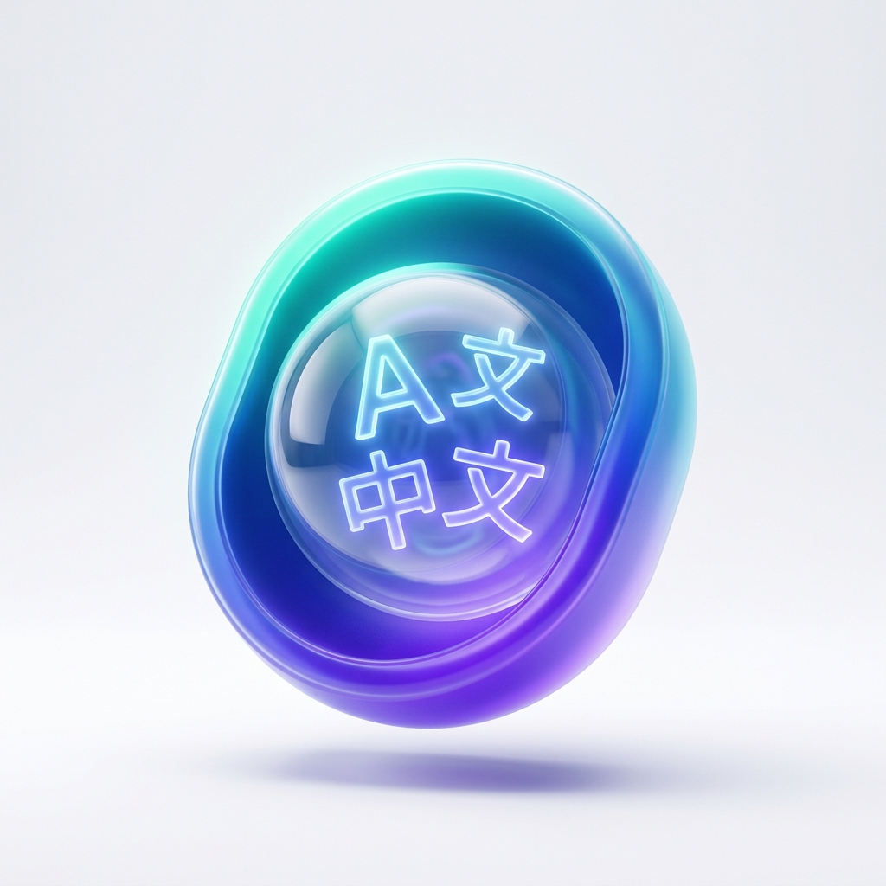

<div align="center">



# FloatTranslator

### 🌊 悬浮翻译器 — Your Always-On-Top AI Translation HUD

一款悬浮于所有窗口之上的 AI 翻译器，支持透明穿透模式、流式 Markdown 渲染，
兼容任意 OpenAI 格式 API（DeepSeek / Ollama / OpenAI / SiliconFlow 等）。

A sleek, frameless, always-on-top AI translator with transparent click-through overlay,
SSE streaming with live Markdown rendering, compatible with any OpenAI-compatible API endpoint.

---

[](https://www.electronjs.org/)
[](LICENSE)
[]()
[]()
[]()

</div>

---

## 💡 Why FloatTranslator? / 项目初衷

> **Author's Note / 作者寄语**
>
> 现有的浏览器页面翻译会直接替换原文，而许多翻译插件也会占据大量的屏幕空间。不同风格的 UI 堆叠也会使得读者的注意力分散。这个项目的初衷是为了读者能够更加自然的让翻译软件融进屏幕画面里，不会分散注意力或者喧宾夺主。希望你用的开心！
>
> Existing browser translation features often directly replace the original text, while many translation plug-ins occupy excessive screen space. Clunky, mismatched UIs also distract the reader's focus. The primary goal of this project is to allow the translation overlay to blend naturally into the screen environment, eliminating distractions and keeping the user focused on the content. I hope you enjoy using it!

---

## ✨ Features / 功能亮点

### 🔮 Transparent Click-Through Overlay / 透明穿透模式

> The killer feature that sets FloatTranslator apart from every other translation tool.

Enter **Transparent Mode** and the window becomes a semi-transparent HUD overlay. Your mouse clicks **pass through** the translator window to interact with the application underneath — read PDFs, code, or browse the web while the translation floats above like a heads-up display. Only the compact control capsule and panel edges respond to mouse input for dragging and interaction.

进入**透明模式**后，窗口变为半透明的 HUD 覆盖层。鼠标点击可以**穿透**翻译器窗口，直接操作底层的应用——阅读 PDF、写代码、浏览网页时，翻译结果如同抬头显示器悬浮于上方。只有紧凑的控制胶囊和面板边缘区域响应鼠标输入。

### 🚀 SSE Streaming with Live Markdown / 流式 Markdown 渲染

Translation results stream in **real-time** via Server-Sent Events (SSE), rendered as Markdown on-the-fly. Watch your translation appear character by character with proper formatting — headers, bold, lists, code blocks — all rendered live.

翻译结果通过 SSE 协议**实时流式**返回，边接收边渲染 Markdown 格式。支持标题、加粗、列表、代码块等富文本即时呈现。

### 🔌 API Agnostic / 兼容任意 API

Works with **any OpenAI-compatible API endpoint**. Not locked into a single provider.

兼容**任何 OpenAI 格式的 API 端点**，不锁定任何单一提供商。

| Provider / 提供商 | Example Endpoint / 示例端点 | Notes / 备注 |
|---|---|---|
| **Ollama** (Local) | `http://localhost:11434/v1/chat/completions` | 🔒 完全本地，零成本，隐私安全 |
| **DeepSeek** | `https://api.deepseek.com/chat/completions` | 高性价比中文翻译 |
| **OpenAI** | `https://api.openai.com/v1/chat/completions` | GPT-4o / GPT-4.1 |
| **SiliconFlow** | `https://api.siliconflow.cn/v1/chat/completions` | 国内高速访问 |
| **Any compatible** | Your custom endpoint | 任何兼容 OpenAI 格式的服务 |

### 🌍 8-Language Interface / 8 国语言界面

The entire UI is fully internationalized. Switch interface language on-the-fly without restarting:

整个界面完整国际化，无需重启即可实时切换语言：

🇬🇧 English · 🇨🇳 简体中文 · 🇯🇵 日本語 · 🇰🇷 한국어 · 🇩🇪 Deutsch · 🇫🇷 Français · 🇪🇸 Español · 🇷🇺 Русский

### 🎨 Premium Design / 精致设计

- **Glassmorphic UI** — Frosted glass aesthetics with subtle shimmer animations
- **Dark / Light Themes** — Smooth theme transitions
- **Adjustable Opacity** — Fine-tune window and transparent mode opacity independently
- **Adjustable Font Size** — Customize text size for readability
- **Horizontal / Vertical Layout** — Switch between side-by-side and stacked translation panels
- **Frameless Window** — Modern, borderless window with custom title bar controls

---

## 📦 Quick Start / 快速开始

### Prerequisites / 前置要求

- [Node.js](https://nodejs.org/) v18+
- [Git](https://git-scm.com/)

### Install & Run / 安装与运行

```bash
# Clone the repository / 克隆仓库
git clone https://github.com/YOUR_USERNAME/FloatTranslator.git
cd FloatTranslator

# Install dependencies / 安装依赖
npm install

# Launch the app / 启动应用
npm start
```

### First Launch / 首次启动

1. Click the ⚙️ **Settings** gear icon in the toolbar
2. Enter your **API URL** and **API Key** (see [API Configuration](#-api-configuration--api-配置) below)
3. Choose a **Model** name (e.g., `deepseek-chat`, `gpt-4o`, `qwen2.5`)
4. Click **Save** — You're ready to translate!

---

## ⚙️ API Configuration / API 配置

### Using Ollama (Free & Local) / 使用 Ollama（免费本地）

[Ollama](https://ollama.com/) lets you run large language models locally with complete privacy.

```bash
# 1. Install Ollama (https://ollama.com/)

# 2. Pull a translation-capable model / 拉取翻译模型
ollama pull qwen2.5

# 3. Ollama automatically serves an OpenAI-compatible API
#    FloatTranslator settings:
#    API URL:  http://localhost:11434/v1/chat/completions
#    API Key:  ollama    (any non-empty string)
#    Model:    qwen2.5
```

### Using DeepSeek / 使用 DeepSeek

```
API URL:  https://api.deepseek.com/chat/completions
API Key:  sk-your-deepseek-key
Model:    deepseek-chat
```

### Using OpenAI / 使用 OpenAI

```
API URL:  https://api.openai.com/v1/chat/completions
API Key:  sk-your-openai-key
Model:    gpt-4o
```

---

## 🏗️ Build / 打包构建

### Windows Portable / Windows 免安装版

```bash
npm run pack
```

Output: `dist/FloatTranslator-win32-x64/FloatTranslator.exe`

> [!IMPORTANT]
> **⚠️ Windows Security Warning for Releases / 免安装版运行安全提示**
> 
> Since this open-source application is not signed with an expensive Microsoft developer certificate, Windows Defender SmartScreen or local application policies (like AppLocker) may block execution with a warning like *"Application control policy blocked this file (应用程序控制策略已阻止此文件)"*.
> 
> **How to fix / 解决办法:**
> 1. Right-click the downloaded `.zip` or `.rar` archive file and select **Properties (属性)**.
> 2. At the bottom of the *General (常规)* tab, check the **Unblock (解除锁定)** box, then click **Apply / OK (应用/确定)**.
> 3. Make sure to **fully extract** the folder to a local directory (e.g., `D:/Software`) before running `FloatTranslator.exe`. Do not double-click to run directly from inside the zip/rar viewer.
> 
> 由于开源软件没有购买昂贵的微软数字签名证书，Windows 安全策略或防护软件（如 SmartScreen）可能会在运行或固定到任务栏时拦截，并报错 *“应用程序控制策略已阻止此文件”*。
> 
> **如何解决：**
> 1. 右键点击下载的 `.zip` 或 `.rar` 压缩包，选择 **属性 (Properties)**。
> 2. 在“常规”选项卡最下方，勾选 **解除锁定 (Unblock)**，点击**应用/确定**。
> 3. 请务必先将压缩包**完整解压**到本地非系统目录（如 `D:/` 盘某文件夹）中，再双击运行 `FloatTranslator.exe`。请勿直接在压缩包预览界面双击打开。

---

## 🔬 Technical Deep Dive / 技术解密

### How Click-Through Works / 透明穿透是如何实现的

The transparent overlay mode is the most technically challenging feature. Here's how it works:

透明穿透模式是技术上最具挑战性的功能。其核心原理如下：

```
┌─────────────────────────────────────────┐
│  FloatTranslator Window (transparent)   │
│                                         │
│   ┌─────────────────────────────────┐   │
│   │     Translation Output Panel    │   │  ← Mouse clicks PASS THROUGH
│   │     (semi-transparent text)     │   │    鼠标点击穿透到底层应用
│   └─────────────────────────────────┘   │
│                                         │
│   ╔══════════════════╗                  │
│   ║  Control Capsule ║ ← Mouse ACTIVE  │  ← Only this area responds
│   ║  [Clear][Paste]  ║   鼠标在此激活   │    只有该区域响应鼠标
│   ╚══════════════════╝                  │
│                                         │
└─────────────────────────────────────────┘
         ↓ clicks pass through ↓
┌─────────────────────────────────────────┐
│  Your Application (IDE / PDF / Browser) │  ← Receives all mouse events
└─────────────────────────────────────────┘
```

**Core mechanism / 核心机制:**

1. **`BrowserWindow.setIgnoreMouseEvents(true, { forward: true })`** — Tells Electron to let all mouse events pass through the window, but **forward** `mousemove` events to the renderer so we can detect cursor position.

2. **Geometric hit-testing in the renderer** — On every `mousemove`, we calculate whether the cursor is within:
   - The **control capsule** bounding box (the compact button bar)
   - A **12px edge zone** around translation panels (for resize/drag)

3. **Dynamic toggling** — When the cursor enters an interactive zone, we call `setIgnoreMouseEvents(false)` to re-enable mouse input. When it leaves, we re-enable passthrough.

```javascript
// Simplified core logic
document.addEventListener('mousemove', (e) => {
  const capsule = dragZone.getBoundingClientRect();
  const inCapsule = e.clientX >= capsule.left && e.clientX <= capsule.right
                 && e.clientY >= capsule.top  && e.clientY <= capsule.bottom;

  if (inCapsule || inPanelEdge) {
    electronAPI.setIgnoreMouseEvents(false);  // Activate interaction
  } else {
    electronAPI.setIgnoreMouseEvents(true, { forward: true });  // Pass through
  }
});
```

This creates a seamless experience where the translator window is effectively "intangible" except for its control surfaces.

这样就实现了一个无缝的体验：翻译器窗口在视觉上浮于所有窗口之上，但在触控层面上几乎"不可触碰"，只有控制面板部分才响应鼠标操作。

---

## 📁 Project Structure / 项目结构

```
FloatTranslator/
├── main.js          # Electron main process — window creation, IPC, SSE streaming
├── preload.js       # Context bridge — secure IPC API exposure
├── renderer.js      # UI logic — i18n, themes, transparent mode, translation
├── index.html       # App layout — toolbar, panels, settings modal
├── style.css        # Design system — glassmorphism, themes, animations
├── package.json     # Project metadata and scripts
├── assets/
│   ├── icon.png     # App icon (source)
│   └── icons/
│       ├── icon.ico   # Windows icon
│       └── icon.icns  # macOS icon
└── LICENSE          # MIT License
```

---

## 🤝 Contributing / 参与贡献

Contributions are welcome! Feel free to:

欢迎贡献代码！您可以：

1. 🍴 **Fork** the repository
2. 🔨 Create a feature branch: `git checkout -b feature/amazing-feature`
3. 💾 Commit your changes: `git commit -m 'Add amazing feature'`
4. 📤 Push to your branch: `git push origin feature/amazing-feature`
5. 🎉 Open a **Pull Request**

### Ideas for Contribution / 贡献方向

- 🔥 **Hotkey-triggered clipboard translation** — Global shortcut to translate clipboard contents instantly
- 📚 **Translation history** — Save and browse past translations
- 🌐 **Multi-provider fallback** — Automatic failover between API providers
- 📱 **macOS / Linux packaging** — Extend build scripts for other platforms
- 🎯 **OCR integration** — Screenshot-to-translation workflow

## 🤖 AI-Assisted Development / AI 协同开发说明

This project was built using state-of-the-art AI-assisted development. It was pair-programmed between **gaoyixuan259** and **Antigravity**, a powerful agentic coding assistant designed by the Google DeepMind team. From building the transparent click-through core mechanics, resolving complex flexbox collapses, to auditing XSS vulnerabilities and generating glassmorphic icons, AI played a key role in bringing this project to life.

本项目由开发者与 AI 深度协同开发完成。由 **gaoyixuan259** 与 Google DeepMind 团队设计的智能编程助手 **Antigravity** 结对编程。从构建核心的透明穿透机制、解决复杂的布局坍塌，到审计 XSS 安全漏洞、以及利用 AI 图像模型 Imagen 生成高档玻璃拟态图标，AI 在本项目的诞生过程中扮演了关键的协同角色。

---

## 📄 License / 许可证

This project is licensed under the [MIT License](LICENSE).

本项目采用 [MIT 许可证](LICENSE) 开源。

---

<div align="center">

**Built with ❤️ using Electron**

如果这个项目对你有帮助，欢迎给一个 ⭐ Star！

If you find this project useful, please consider giving it a ⭐ Star!

</div>
